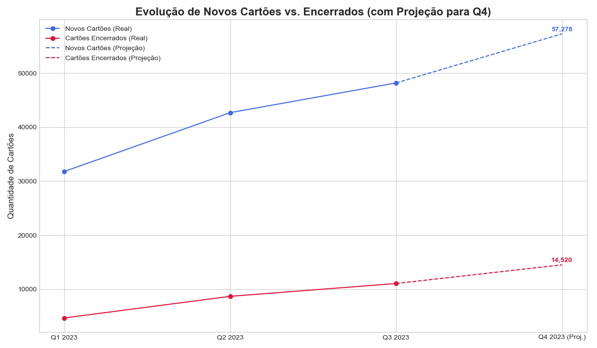

# 📊 Case Técnico: Análise e Otimização da Base de Cartões (QMR)

## 🎯 Objetivo

Automatizar o processo de relatórios trimestrais QMR e extrair insights estratégicos a partir dos dados transacionais para otimizar a base de cartões da Flash, identificando oportunidades de crescimento, migração de tecnologia e recuperação de receita.

## 💰 Principais Resultados Estratégicos

* **R$ 9,6 milhões/trimestre** identificados em receita potencial perdida devido a cartões bloqueados, justificando a criação de fluxos de reativação.
* **Top 10 empresas** mapeadas, concentrando mais de 3.500 cartões PIN, representando um alvo claro para campanhas de migração B2B.
* **25.267 cartões** com expiração no Q4/2023 segmentados por status (ativo/inativo) para direcionar ações de renovação e reengajamento.
* **100%** de automação no cálculo das métricas QMR, eliminando processos manuais e garantindo consistência.

## 🛠️ Tecnologias Utilizadas


## 📈 Principais Visualizações do Projeto

#### Penetração da Tecnologia Contactless vs. PIN
Este gráfico de barras mostra a distribuição dos cartões ativos no final do Q3 2023. A análise revela uma forte adoção da tecnologia Contactless (79.8%), mas também uma base relevante de 20.2% de cartões PIN, que representa uma oportunidade clara para campanhas de migração.


#### Projeção para Q4 de Novos Cartões vs. Encerrados
O gráfico de linhas compara a aquisição de novos cartões com o número de cartões encerrados por trimestre, incluindo uma projeção linear para o Q4. Ele evidencia um crescimento saudável na aquisição, mas também um aumento na taxa de encerramento que merece atenção.



## 📁 Estrutura do Projeto

```
case_tecnico_mastercard_qmr/
├── data/                          # Dados brutos (não versionados)
│   ├── cards.csv
│   ├── cards_status.csv
│   └── cards_transactions.csv
├── notebooks/                     # Análises e exploração
│   └── EDA.ipynb                 # Notebook principal com todas as análises
├── outputs/                       # Resultados gerados
│   ├── graficos/                 # Visualizações exportadas
│   └── tabelas/                  # Métricas QMR consolidadas
├── requirements.txt              # Dependências do projeto
├── README.md                     # Documentação do projeto
└── .gitignore                    # Arquivos ignorados pelo Git
```

## 🔧 Configuração do Ambiente

### Pré-requisitos
- Python 3.8+
- Jupyter Notebook/Lab
- Git

### Instalação

1. **Clone o repositório:**
```bash
git clone https://github.com/EanesRibeiro/case_tecnico_mastercard_qmr.git
cd case_tecnico_mastercard_qmr
```

2. **Crie um ambiente virtual:**
```bash
python -m venv venv
source venv/bin/activate  # Linux/Mac
# ou
venv\Scripts\activate     # Windows
```

3. **Instale as dependências:**
```bash
pip install -r requirements.txt
```

4. **Baixe os dados:**
   - Acesse: [Google Drive - Dados do Projeto](https://drive.google.com/drive/folders/1T3VXMs0XWnuV59n0puhRTXXlfyDwqwvO)
   - Baixe os arquivos CSV para a pasta `data/`

5. **Execute o notebook:**
```bash
jupyter notebook notebooks/EDA.ipynb
```

## 📊 Metodologia

A análise foi conduzida em três etapas principais:

### 1. Exploração e Limpeza dos Dados (EDA)
* **Carregamento:** Ingestão de 3 tabelas principais (`cards`, `cards_status`, `cards_transactions`).
* **Validação:** Verificação de integridade referencial, duplicatas, valores nulos e consistência temporal.
* **Transformação:** Conversão de colunas de data para `datetime` com fuso horário (UTC) e padronização de tipos de dados.
* **Otimização de Performance:** Implementação da função vetorizada `get_status_on_date_vectorized` para processar snapshots de status de milhões de registros de forma eficiente, evitando loops e garantindo escalabilidade.

### 2. Construção das Métricas QMR
* Cálculo das métricas de fluxo da base de cartões: Início/Fim do trimestre, Novos, e Encerrados.
* Contagem de cartões únicos com transações por período.
* Validação da equação de balanço: `Fim ≈ Início + Novos - Encerrados` para garantir a consistência dos dados.

### 3. Análises Estratégicas
* Análise da penetração da tecnologia **Contactless vs. PIN**, com segmentação por empresa para identificar alvos de migração.
* Estudo do impacto de **cartões bloqueados**, estimando a perda de receita potencial.
* Mapeamento de **cartões expirando** no próximo trimestre para planejar ações de renovação e reengajamento.

## 🔑 Função-Chave de Performance

### `get_status_on_date_vectorized(status_df, ref_date)`
Esta função é o núcleo técnico do projeto. Ela determina o status mais recente de **todos** os cartões em uma data de referência de forma otimizada.

* **Abordagem:** Utiliza operações vetorizadas do Pandas, que são ordens de magnitude mais rápidas do que um loop `for` ou a aplicação de funções linha a linha (`.apply`).
* **Impacto:** Permite que o cálculo das métricas QMR, que exige múltiplas "fotografias" da base de cartões, seja executado em segundos, em vez de horas.

**Parâmetros:**
* `status_df` (DataFrame): O DataFrame `cards_status` com o histórico.
* `ref_date` (datetime): A data de referência para a consulta.

**Retorna:**
* `DataFrame`: Um DataFrame contendo o último status conhecido de cada cartão na data de referência.

## 🎯 Recomendações Estratégicas

Com base nos insights gerados na análise, as seguintes ações são recomendadas:

#### 1. Gestão de Bloqueios e Recuperação de Receita
* **Implementar alertas proativos** para a equipe de Sucesso do Cliente quando um cartão permanecer em `TEMPORARILY_BLOCKED` por um período prolongado (ex: acima de 7 dias).
* **Criar campanhas de reativação** direcionadas para clientes com bloqueios retidos, oferecendo suporte para resolução do problema.
* **Analisar as causas-raiz** dos bloqueios para identificar padrões e implementar melhorias de produto ou processo que reduzam a ocorrência.

#### 2. Migração para Contactless
* **Campanha B2B:** Focar a migração de cartões PIN para Contactless nas **top 10 empresas** identificadas, que concentram o maior volume da tecnologia antiga.
* **Renovação Inteligente:** Aproveitar o ciclo de expiração dos cartões para realizar o **upgrade automático** de todos os cartões PIN que serão renovados, otimizando a logística.

#### 3. Gestão do Ciclo de Vida do Cartão (Expiração)
* **Renovação Proativa:** Para os **21.592 cartões ativos** que expiram no Q4, garantir um processo de renovação automática e sem atritos para manter a receita e a satisfação.
* **Campanha de Reengajamento:** Para os **916 cartões bloqueados** que expiram no Q4, criar uma campanha específica para reengajá-los, usando a necessidade de um novo cartão como incentivo para resolver a pendência do bloqueio.

---

## 📞 Contato

**Desenvolvido por:** Eanes Ribeiro
**LinkedIn:** [linkedin.com/in/eanes-ribeiro](https://linkedin.com/in/eanes-ribeiro)
**GitHub:** [@EanesRibeiro](https://github.com/EanesRibeiro)

## 📄 Licença

Este projeto foi desenvolvido como case técnico para processo seletivo. Todos os dados são fictícios e utilizados apenas para fins educacionais.